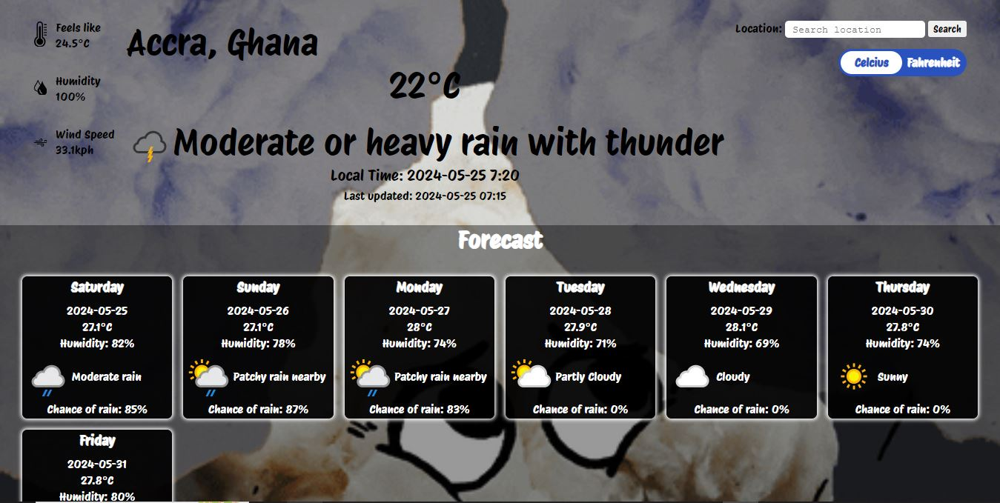

# Weather App
A simple weather app that shows the current weather conditions and a seven day forecast for the users inputed location.

## Table of contents

- [Overview](#overview)
  - [The challenge](#the-challenge)
  - [Screenshot](#screenshot)
  - [Links](#links)
- [My process](#my-process)
  - [Built with](#built-with)

## Overview

### The Challenge

- Users should be able to search for a specific location and toggle displaying the data in Fahrenheit or Celsius.
- Change the look of the page based on the data, maybe by changing the color of the background or by adding images that describe the weather.

### Screenshot

### Links

- Live Site URL :[live site URL](https://mayorr-star.github.io/Weather_App/)

## My Process

## Built With
- HTML / CSS
- ESlint
- Webpack
- Javascript

## LICENSE
This project is MIT licensed